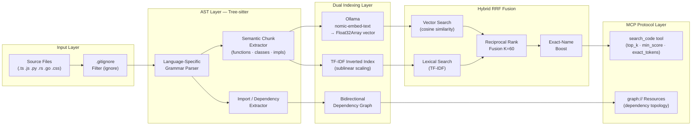

<h1 align="center">graph-indexer-mcp</h1>

<p align="center">
  <strong>Zero-DB · Air-Gapped · AST-Precision · Hybrid RRF Search</strong><br>
  <em>The production-grade Model Context Protocol (MCP) code indexer for AI agents that demand mathematical precision, absolute privacy, and massive token savings.</em>
</p>

<p align="center">
  <a href="https://www.npmjs.com/package/graph-indexer-mcp"></a>
  <a href="LICENSE"></a>
</p>

---

## 💸 The ROI: Stop Burning Tokens & Time

When coding with AI agents (Claude Desktop, Cursor, Copilot), **context is money and time**. Standard agents brute-force file reads, pulling thousands of lines of irrelevant code into the context window just to read a single function. This drains your API credits, slows down response times, and confuses the model.

`graph-indexer-mcp` changes the economics of AI development:

| Metric | Standard Agent Behavior | With `graph-indexer-mcp` | The Impact |
| :--- | :--- | :--- | :--- |
| **Token Costs** | Ingests entire 800-line files to find one method (~10k tokens). | Surgically extracts only the exact 15-line AST node (~100 tokens). | **~90% reduction** in input API costs. |
| **Latency (TTFT)** | LLM struggles to process massive context windows. | LLM parses tiny, high-signal payloads. | **Drastically faster** Time-to-First-Token. |
| **Code Accuracy** | Suffers from "Lost in the Middle" syndrome. | 100% focused context + Bidirectional AST topology. | **Zero hallucinations.** Right the first time. |

---

## ⚡ The Problem: Semantic Blindness

Even if you don't care about costs, standard RAG (Retrieval-Augmented Generation) fails at complex codebases.
1. **Dumb Chunking:** Splitting code by "character count" breaks functions in half.
2. **Topology Loss:** Standard search cannot understand that `fileA.ts` imports a function from `fileB.ts`. The agent loses the dependency graph, leading to broken refactors.

## 🚀 The Solution

`graph-indexer-mcp` acts as a surgical retrieval engine for your AI agent. By using Tree-sitter AST parsing, it extracts exact logical units (functions, classes, interfaces) and maps their bidirectional dependencies. 

Combined with a Zero-DB Hybrid Search (Dense Vectors + Sparse TF-IDF), it feeds the LLM **exactly what it needs, and nothing it doesn't**—all entirely in-memory and 100% air-gapped on your local machine.

---

## 🏗️ Architecture



---

## ⚔️ Why This Beats Standard RAG

| Feature | **graph-indexer-mcp** | Standard RAG (ChromaDB + naive chunks) |
| --- | --- | --- |
| **Chunking Strategy** | AST-precise: functions, classes, impls | Naive line-count or token-count splits |
| **Infrastructure** | Zero-DB — pure in-memory `Map` + `Float32Array` | External vector DB (Chroma, Pinecone) |
| **Privacy** | 100% air-gapped (local Ollama) | Often requires cloud embedding APIs |
| **Search Quality** | Hybrid RRF (Dense Vectors + Sparse Lexical) | Dense-only or BM25-only |
| **Dependency Context** | Bidirectional AST topology (`importedBy` / `imports`) | None |
| **Fault Tolerance** | Graceful degradation to pure TF-IDF | Hard failure on embedding downtime |
| **Latency** | Sub-millisecond (V8 + `Float32Array` SIMD layout) | Network RTT + DB query overhead |

---

## 📦 Installation

Add as a development dependency in your repository:

```bash
npm install graph-indexer-mcp --save-dev
```

Add the execution shortcuts to your `package.json`:

```json
"scripts": {
  "mcp:index": "idx-index --repo .",
  "mcp:watch": "idx-watch",
  "mcp:start": "idx-mcp"
}
```

### System Requirements
* **Node.js**: v18+ (ES Modules support)
* **Ollama**: Running at `http://localhost:11434` with the target model downloaded:
```bash
  ollama pull nomic-embed-text
  ```
* **C/C++ Build Toolchain (Optional)**: Tree-sitter uses native C++ compilation bindings. If prebuilt binaries are not available for your platform, a local compiler toolchain (GCC/Clang or VS Build Tools) and `node-gyp` may be required.

---

## 🚦 Quick Start

The architecture is decoupled into three non-blocking phases to prevent resource starvation:

### 1. Bootstrap (Initial Indexing)
Scans the repository, applies your `.gitignore`, builds the `code-index.json`, and generates embeddings:
```bash
npm run mcp:index
```

### 2. Daemon (Real-Time Sync)
Run this in a secondary terminal. It watches for file changes and updates the index atomically with debounced I/O:
```bash
npm run mcp:watch
```

### 3. MCP Server
Point your MCP client (Claude Desktop, VS Code Copilot Agent, Cursor) to this command. The server loads RAM in $O(1)$ and communicates seamlessly via `stdio`:
```bash
npm run mcp:start
```

---

## 🛠️ MCP Protocol Exposed Capabilities

### `search_code` Tool
Hybrid semantic + lexical search with dependency topology.

| Parameter | Type | Default | Description |
| --- | --- | --- | --- |
| `query` | `string` | — | Natural language or code query |
| `exact_tokens` | `string?` | — | Exact function/class name to artificially boost |
| `top_k` | `number` | `5` | Results to return (1–20) |
| `min_score` | `number` | `0.3` | Cosine similarity threshold |
| `include_topology` | `boolean` | `true` | Append dependency graph context |

### `graph://` URI Resource
Returns the full bidirectional dependency topology for any indexed file instantly, without consuming search compute.
```text
URI: graph://dependencies/src/auth/middleware.ts
```
**Agent Response Output:**
```markdown
# Dependency Topology: `src/auth/middleware.ts`

## Imports (2)
- `src/utils/jwt.ts`
- `src/db/session.ts`

## Imported By (3)
- `src/routes/api.ts`
- `src/routes/admin.ts`
- `src/app.ts`
```

---

## 🌍 Polyglot Extension Guide

`graph-indexer-mcp` is polyglot by design. Adding a new language takes four steps. Example for **PHP**:

1. **Install the Grammar:**
```bash
   npm install tree-sitter-php
   ```
2. **Map the Extension** (in `indexer.mjs` and `watch-daemon.mjs`):
```javascript
   import PHP from 'tree-sitter-php';
   const LANGUAGE_MAP = { '.php': PHP.php };
   ```
3. **Register Semantic Nodes:**
```javascript
   const SEMANTIC_NODES = new Set(['function_definition', 'class_declaration']);
   ```
4. **Teach the Import Extractor:**
```javascript
   // Inside extractImportsFromAST()
   else if (node.type === 'require_expression' && ext === '.php') { ... }
   ```
Restart the daemon, and your `.php` files are immediately AST-extracted, dual-indexed, and searchable.

---

## 🧮 Mathematical Integrity

### Sublinear TF Scaling
Term frequencies are aggressively scaled to compress dynamic range:
$$w(t,d) = 1 + \log(f_{t,d})$$
This prevents ubiquitous keywords like `return` or `const` from statistically drowning out semantically rich but less-frequent business logic identifiers.

### Reciprocal Rank Fusion (RRF)
Vector and Lexical scores are merged by rank position rather than raw incompatible scores:
$$\text{score}(d) = \sum_{i} \frac{1}{K + \text{rank}_i(d)} \quad K = 60$$
The exact-name boost adds $1/(K+1)$ (the theoretical maximum single-list contribution) to any AST chunk whose `name` exactly matches the `exact_tokens` parameter.

---

## 👥 Author & Maintainer

Engineered and maintained by **MaquinaTech**.
* **GitHub:** [@MaquinaTech](https://github.com/MaquinaTech)
* **NPM:** [graph-indexer-mcp](https://www.npmjs.com/package/graph-indexer-mcp)

Contributions, issues, and pull requests are highly encouraged.

---

## 📄 License
Released under the [MIT License](LICENSE).