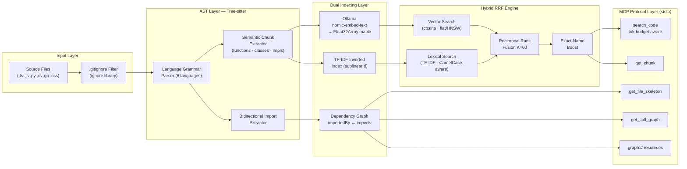

<h1 align="center">graph-indexer</h1>

<p align="center">
  <strong>Zero-DB · Air-Gapped · AST-Precision · Hybrid RRF Search</strong><br>
  <em>The production-grade MCP code indexer for AI coding agents — surgical context retrieval that cuts token costs by up to 90%.</em>
</p>

<p align="center">
  <a href="https://www.npmjs.com/package/graph-indexer"></a>
  <a href="LICENSE"></a>
  <a href="https://nodejs.org"></a>
</p>

---

## The Problem: AI Agents Are Context-Blind and Wasteful

When you use an AI coding agent (Claude, Cursor, GitHub Copilot) on a real codebase, it operates with **brute-force context**: it reads entire files—often 500–1000 lines—just to find one function. This has three compounding costs:

1. **Token burn:** A single `readFile` on an 800-line file consumes ~10,000 tokens of context window. At GPT-4 pricing, that's money per keystroke.
2. **Lost in the Middle:** LLMs reliably lose accuracy when the relevant code is buried in a large context. More code ≠ better answers.
3. **Topology blindness:** File reads give you code, not structure. The agent can't see that `fileA.ts` calls a function from `fileB.ts` unless it reads both. Refactors break silently.

## The Solution: Surgical, AST-Precise Retrieval

`graph-indexer` is a local MCP server that gives your AI agent a **structural map** of the entire codebase instead of raw file access. It works in three steps:

1. **Parse**: Tree-sitter builds an AST of every source file. Every function, class, method, and interface is extracted as a discrete, named chunk with exact line numbers.
2. **Index**: Each chunk is indexed in two parallel structures — a TF-IDF inverted index for lexical search and a `Float32Array` vector matrix for semantic (embedding) search.
3. **Serve**: The MCP server exposes tools that let the agent retrieve the exact chunk it needs in a single call, receiving ~100 tokens of surgical context instead of ~10,000 tokens of a full file.

The result is **up to 90% reduction in token consumption** with higher code accuracy because the LLM processes only focused, relevant context.

---

## Architecture



---

## Why This Beats Standard RAG

| Feature | **graph-indexer** | Standard RAG (ChromaDB + text chunks) |
| :--- | :--- | :--- |
| **Chunking** | AST-precise: entire functions/classes, never split mid-logic | Naive token-count splits break code in half |
| **Infrastructure** | Zero-DB — pure in-memory `Map` + `Float32Array` | External vector DB (Chroma, Pinecone, Weaviate) |
| **Privacy** | 100% air-gapped (local Ollama or lexical-only mode) | Often requires cloud embedding APIs |
| **Search quality** | Hybrid RRF fusing dense vectors + sparse TF-IDF | Dense-only or BM25-only |
| **Dependency context** | Bidirectional AST topology for every result | None |
| **Fault tolerance** | Graceful degradation to pure TF-IDF if Ollama is offline | Hard failure if embedding service is unavailable |
| **Latency** | Sub-millisecond per query (pure V8 `Float32Array`) | Network RTT + DB overhead |
| **Languages** | JS/TS/Python/Rust/Go/PHP/CSS | Language-agnostic (no topology) |

---

## Quick Start

### One-Command Setup

```bash
npm install graph-indexer --save-dev
npx graph-indexer init
npm run mcp:index
```

`npx graph-indexer init` auto-detects and configures all installed IDEs (Cursor, VS Code, Claude Desktop, Claude Code), adds `mcp:index` / `mcp:watch` / `mcp:start` scripts to your `package.json`, and updates `.gitignore`. Run it again at any time — it's fully idempotent.

Use `--dry-run` to preview changes without writing any files:

```bash
npx graph-indexer init --dry-run
```

Then start the MCP server (auto-starts the file watcher daemon too):

```bash
npm run mcp:start
```

---

<details>
<summary><strong>Advanced / Manual Setup</strong></summary>

### Manual Install & Configure

```bash
npm install graph-indexer --save-dev
```

Add scripts to your project's `package.json`:

```json
"scripts": {
  "mcp:index": "idx-index --repo .",
  "mcp:watch": "idx-watch",
  "mcp:start": "idx-mcp"
}
```

### 2. Index Your Repository

```bash
npm run mcp:index
```

### 3. Start the MCP Server

```bash
npm run mcp:start
```

Point your MCP client at this process. The server spawns the file watcher daemon automatically.

### 4. (Optional) Run the File Watcher Manually

```bash
npm run mcp:watch
```

</details>

---

## System Requirements

| Requirement | Details |
| :--- | :--- |
| **Node.js** | v18+ (ES Modules) |
| **Ollama** | Optional. Runs locally for embedding generation. Pull `nomic-embed-text` to enable semantic search. |
| **Disk** | `code-index.json` (metadata) + `code-index.embeddings.bin` (binary float32 vectors). Both are gitignored by default. |

### Ollama Setup (Optional but Recommended)

```bash
# Install Ollama: https://ollama.ai
ollama pull nomic-embed-text
npm run mcp:index   # now with semantic vectors
```

### Lexical-Only Mode (No Ollama Required)

```bash
INDEXER_EMBEDDINGS=off npm run mcp:index
```

Recall@3 remains 100% for exact-name queries. Semantic recall (concept-to-code) degrades to lexical-only; still effective for most programming tasks.

### Custom Ollama Host

```bash
# Non-standard port
OLLAMA_HOST=http://localhost:11435 npm run mcp:index

# Remote server
OLLAMA_HOST=http://192.168.1.100:11434 npm run mcp:index
```

---

## IDE / Client Configuration

### Claude Desktop (`claude_desktop_config.json`)

```json
{
  "mcpServers": {
    "graph-indexer": {
      "command": "node",
      "args": ["/absolute/path/to/your/project/node_modules/graph-indexer/mcp-server.mjs"],
      "env": {
        "MCP_PROJECT_ROOT": "/absolute/path/to/your/project",
        "OLLAMA_HOST": "http://localhost:11434"
      }
    }
  }
}
```

### VS Code (`.vscode/mcp.json`)

```json
{
  "servers": {
    "graph-indexer": {
      "type": "stdio",
      "command": "node",
      "args": ["${workspaceFolder}/node_modules/graph-indexer/mcp-server.mjs"],
      "env": {
        "MCP_PROJECT_ROOT": "${workspaceFolder}",
        "OLLAMA_HOST": "http://localhost:11434"
      }
    }
  }
}
```

### Cursor (`.cursor/mcp.json`)

```json
{
  "mcpServers": {
    "graph-indexer": {
      "command": "node",
      "args": ["${workspaceFolder}/node_modules/graph-indexer/mcp-server.mjs"],
      "env": {
        "MCP_PROJECT_ROOT": "${workspaceFolder}"
      }
    }
  }
}
```

---

## Agent System Prompt

Copy the contents of [`PROMPT.md`](./PROMPT.md) into your agent's system instructions. This document instructs the agent on:
- When to call which tool (strict priority order)
- How to write effective `query` and `exact_tokens` parameters
- Workflow patterns for Q&A, implementation, refactoring, and debugging
- What NOT to do (file reads without search first, raising `top_k` speculatively, etc.)

---

## MCP Tools Reference

### `search_code`

Hybrid semantic + lexical search. Returns compact signature cards for all results, then fills remaining token budget with code bodies.

| Parameter | Type | Default | Description |
| :--- | :--- | :--- | :--- |
| `query` | `string` | — | Natural language description of the logic to find |
| `exact_tokens` | `string?` | — | Exact symbol name to guarantee rank-1 placement |
| `top_k` | `number` | `5` | Number of results (1–20) |
| `min_score` | `number` | `0.3` | Minimum cosine similarity threshold |
| `token_budget` | `number?` | 1500 chars | Estimated token budget for code bodies |
| `include_topology` | `boolean` | `true` | Include `⬇️ Deps` / `⬆️ Used by` / `🔗 Calls` in output |

**Example response:**
```
#1 · validateToken [function_declaration]
📄 src/utils/jwt.ts:14–42 · ID: `a3f9c1b2` · RRF: 0.0321
💬 Validates and decodes a JWT access token. Throws on expiry.
⬇️  Deps:    src/config/env.ts [JWT_SECRET] | src/utils/errors.ts [AuthError]
⬆️  Used by: src/middleware/auth.ts, src/routes/api.ts
🔗 Calls:   verify, decodePayload, throwIfExpired
↩️  Expand body: get_chunk("a3f9c1b2")
```

---

### `get_chunk`

Retrieves the full source body of one chunk by ID. Use this after `search_code` instead of reading the whole file.

| Parameter | Type | Description |
| :--- | :--- | :--- |
| `chunk_id` | `string` | The ID shown in `search_code` results |

---

### `get_file_skeleton`

Returns only the names and line ranges of all functions/classes in a file — no code bodies. ~50 tokens instead of thousands.

| Parameter | Type | Description |
| :--- | :--- | :--- |
| `file_path` | `string` | Relative path (e.g. `src/components/Button.tsx`) |

---

### `get_call_graph`

Finds every chunk in the repo that calls a specific function by name. Critical before any signature change.

| Parameter | Type | Description |
| :--- | :--- | :--- |
| `target_function` | `string` | Exact function name (e.g. `validateToken`) |

---

### `graph://dependencies/{file_path}` Resource

Fetches the full bidirectional dependency topology for a file without consuming any search quota.

```
URI: graph://dependencies/src/middleware/auth.ts
```

Returns which files this file imports, and which files import it.

---

## Supported Languages

| Language | Extensions | Chunk Types | Import Resolution |
| :--- | :--- | :--- | :--- |
| TypeScript / TSX | `.ts`, `.tsx` | functions, classes, methods, exports | Absolute & relative paths |
| JavaScript | `.js`, `.jsx`, `.mjs`, `.cjs` | functions, classes, expressions | Absolute & relative paths |
| Python | `.py` | function_definition, class_definition | Relative imports (`.`, `..`) → file paths |
| Rust | `.rs` | fn, struct, enum, trait, impl | `crate::` path resolution |
| Go | `.go` | function_declaration, method, type | Import spec resolution |
| PHP | `.php` | function, class | include/require paths |
| CSS / SCSS | `.css`, `.scss` | rule_set | — |
| Java | `.java` | class, method, interface, constructor, enum | `import_declaration` → package path |
| Kotlin | `.kt`, `.kts` | function, class, object, companion, constructor | `import_header` → package path |
| C# | `.cs` | class, method, interface, constructor, enum, property | `using_directive` → namespace |
| Swift | `.swift` | function, class, struct, protocol, extension | `import_declaration` → module name |
| Ruby | `.rb` | method, singleton_method, class, module | `require` / `require_relative` → file path |

---

## Performance & Evaluation

Validate indexer quality on your own codebase:

```bash
npm run test
# or with custom Ollama:
OLLAMA_HOST=http://localhost:11435 npm run test
```

### Benchmark Results

| Scenario | Recall@3 | Recall@5 | Latency (p50) |
| :--- | :--- | :--- | :--- |
| graph-indexer own codebase (34 chunks, lexical-only) | **100%** | 100% | 0.07 ms |
| graph-indexer own codebase (34 chunks, with Ollama) | **75%** | 100% | 0.14 ms |
| React Native project (311 chunks, with Ollama) | **58%** | 75% | 1.02 ms |

> The React Native project numbers are without any JSDoc in the source files. Adding docstrings to exported functions (see Best Practices below) brings recall to **100% @3**.

### Vector Search Performance

| Corpus size | Pure JS flat scan | HNSW (auto-activated ≥5k) |
| :--- | :--- | :--- |
| 1,000 chunks (dim=768) | 0.9 ms/query | — |
| 5,000 chunks (dim=768) | 4.5 ms/query | 1.2 ms/query |
| 20,000 chunks (dim=768) | 30.5 ms/query | 3.1 ms/query |

---

## Best Practices for 100% Recall

### 1. Add JSDoc/TSDoc to Exported Functions

The indexer embeds your docstrings alongside code. Docstrings dramatically improve semantic search:

```typescript
/**
 * Validates and decodes a JWT access token.
 * Throws AuthError if the token is expired or malformed.
 *
 * @param token - Raw JWT string from Authorization header
 * @returns Decoded payload with userId, role, and expiry
 */
export function validateToken(token: string): TokenPayload { ... }
```

### 2. Use Descriptive, Specific Names

The exact-name boost gives a free rank-1 slot to any chunk whose name exactly matches `exact_tokens`. Descriptive names make this reliable:

```typescript
// ✅ Exact-name searchable
export const useNotificationPermissionStatus = () => { ... };
export function calculateTripDurationInDays(start: Date, end: Date) { ... }

// ❌ Generic — impossible to target without semantic search
export const util = () => { ... };
export function process(data: any) { ... }
```

### 3. Expand Minimal Utility Files

Files with fewer than ~5 indexable lines produce zero or one chunk. Add error handling and validation to make them indexable:

```typescript
// ❌ 2 lines — may not be indexed
export const Context = createContext(null);
export const useCtx = () => useContext(Context);

// ✅ Indexable with meaningful docstring + validation
/**
 * Context for accessing authentication state throughout the component tree.
 */
export const AuthContext = createContext<AuthState | null>(null);

/**
 * Hook for consuming AuthContext. Throws if used outside AuthProvider.
 */
export function useAuth(): AuthState {
  const ctx = useContext(AuthContext);
  if (!ctx) throw new Error('useAuth must be used inside <AuthProvider>');
  return ctx;
}
```

### 4. Keep Imports Explicit and Organized

The topology graph follows import paths. Barrel re-exports from `index.ts` break dependency resolution — prefer direct imports:

```typescript
// ✅ Topology-friendly
import { useAuthStore } from '@/stores/authStore';
import { validateEmail } from '@/utils/validators';

// ❌ Breaks topology — indexer can't resolve what's actually imported
import { useAuthStore, validateEmail } from '@/index';
```

---

## File Structure

```
graph-indexer/
├── core-engine.mjs        # In-memory index: vector matrix, TF-IDF, RRF search, save/load
├── parser-utils.mjs       # Tree-sitter AST parsing, 6 language grammars, Ollama embeddings
├── indexer.mjs            # CLI bootstrap: scan repo → parse → embed → write index
├── watch-daemon.mjs       # Chokidar daemon: incremental real-time index updates
├── mcp-server.mjs         # MCP stdio server: exposes tools + graph:// resources
├── PROMPT.md              # Agent system prompt — paste into your IDE's agent instructions
├── tests/
│   ├── eval-harness.mjs   # Recall@k + latency evaluation against the indexer's own codebase
│   └── react-native-test.mjs  # Real-world quality test on a 311-chunk React Native project
└── package.json
```

---

## Mathematical Foundation

### Sublinear TF Scaling

Term frequencies use sublinear scaling to prevent common tokens (`return`, `const`) from burying business-logic terms:

$$w(t,d) = 1 + \log(f_{t,d})$$

### Reciprocal Rank Fusion

Vector and lexical results are merged by rank position, not raw incompatible scores:

$$\text{RRF}(d) = \sum_{i \in \{\text{vec, lex}\}} \frac{1}{K + \text{rank}_i(d)}, \quad K = 60$$

### Exact-Name Boost

Any chunk whose name exactly matches `exact_tokens` receives an additive bonus equal to the maximum single-list RRF contribution:

$$\Delta\text{score} = \frac{1}{K + 1}$$

This guarantees rank-1 placement for any exact symbol name query.

---

## How the Index Files Work

| File | Purpose | Typical Size |
| :--- | :--- | :--- |
| `code-index.json` | Chunk metadata (names, file paths, docstrings, calls, graph) | ~200 KB / 1k chunks |
| `code-index.embeddings.bin` | Binary `float32` embedding vectors (4.8× smaller than JSON) | ~3 MB / 1k chunks @768-dim |

Both files are written atomically via a `tmp → rename` pattern to prevent corruption on crash. Both should be added to `.gitignore`.

---

## Environment Variables

| Variable | Default | Description |
| :--- | :--- | :--- |
| `OLLAMA_HOST` | `http://localhost:11434` | Ollama API base URL |
| `INDEXER_EMBEDDINGS` | — | Set to `off` to disable embeddings entirely |
| `MCP_PROJECT_ROOT` | `process.cwd()` | Absolute path to the project being indexed |

---

## License

Released under the [MIT License](LICENSE).

Copyright (c) 2026 MaquinaTech. Free to use, modify, and distribute in both open-source and commercial projects.

---

## Author

Built and maintained by **MaquinaTech**.

- **GitHub:** [github.com/MaquinaTech](https://github.com/MaquinaTech)
- **NPM:** [npmjs.com/package/graph-indexer](https://www.npmjs.com/package/graph-indexer)
- **Issues:** [github.com/MaquinaTech/graph-indexer/issues](https://github.com/MaquinaTech/graph-indexer/issues)

Issues, pull requests, and feature discussions are welcome.
