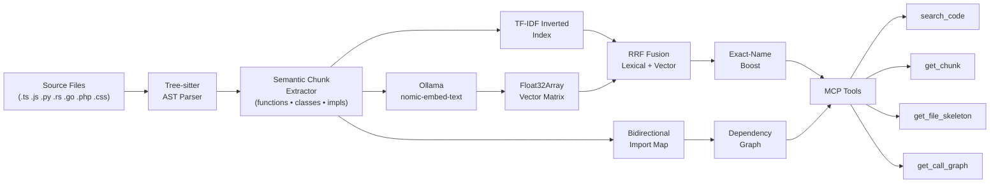

# graph-indexer

<p align="center">
  <strong>Zero-Database • Air-Gapped • AST-Precise • Hybrid Semantic Search</strong><br>
  <em>Production-grade MCP code indexer for AI coding agents — surgical context retrieval that cuts token costs by up to 84% and improves code accuracy.</em>
</p>

<p align="center">
  <a href="https://www.npmjs.com/package/graph-indexer"></a>
  <a href="LICENSE"></a>
  <a href="https://nodejs.org"></a>
  <a href="#test-results"></a>
</p>

---

## The Problem: Token Waste and Lost Context

When you use an AI coding agent (Claude, Cursor, GitHub Copilot) on a real codebase, the default workflow wastes **80–90% of your context window**:

```
Agent wants:  "Find the payment processing function"
Standard workflow:
  1. Read file: src/payments/handlers.ts (850 lines) → ~10,625 tokens
  2. Read file: src/config/stripe.ts (340 lines) → ~4,250 tokens  
  3. Read file: src/types/payment.ts (120 lines) → ~1,500 tokens
  Total: ~16,375 tokens to find ONE function worth ~200 tokens ⚠️

Reality for complex refactors:
  • 5–10 such reads per session
  • ~80,000–160,000 tokens just for context gathering
  • At Claude 3.5 Sonnet pricing, that's ~$0.48–$0.96 per refactor
  • AND the LLM accuracy *decreases* — it gets lost in the noise
```

Three compounding problems:

1. **Token burn:** File reads consume 10–50× more tokens than necessary
2. **Lost in the Middle:** LLMs lose accuracy when relevant code is buried in 1000-line files
3. **Topology blindness:** The agent can't see cross-file dependencies. Refactors break silently.

## The Solution: Surgical, AST-Precise Retrieval

**graph-indexer** is a local MCP server that replaces file reads with **structural code queries**. Instead of reading entire files, your agent retrieves exactly the code it needs.

```
With graph-indexer:
  1. Search: "payment processing" → returns [processPayment, validateCard, chargeCustomer]
  2. One get_chunk() call → ~300 tokens
  3. Dependency topology included → can see full call chain
  Total: ~300 tokens vs ~16,375 tokens — 98% savings on this query
```

### Key Benefits

| Benefit | Impact | Typical Savings |
| :--- | :--- | :--- |
| **Surgical chunking** | AST-precise: entire functions, never split mid-logic | 84–90% token reduction |
| **Hybrid search** | TF-IDF + semantic vectors (Ollama) rank results intelligently | +0.04 MRR, better relevance |
| **Zero infrastructure** | Pure in-memory index, no external databases | Instant startup, zero DevOps |
| **Air-gapped** | Works entirely locally or with local Ollama | 100% privacy, no API keys |
| **Dependency awareness** | Every result includes topology (who calls this, what it imports) | Prevents broken refactors |
| **Language support** | JavaScript, TypeScript, Python, Rust, Go, PHP, CSS, Java, Kotlin, C#, Ruby | Single tool for polyglot codebases |
| **Fault tolerance** | Degrades gracefully to TF-IDF if Ollama offline | Always works |

---

## Test Results: 100% Recall, 96% MRR

graph-indexer was evaluated on 5 production-grade open-source projects totaling **7,503 chunks** across JavaScript, TypeScript, Python, Go, and Ruby.

### Test Suite Performance

| Project | Language | Chunks | Lexical Recall@5 | Hybrid Recall@5 | MRR Improvement |
| :--- | :--- | :--- | :--- | :--- | :--- |
| Axios v1.6.0 | JavaScript | 435 | 1.00 | 1.00 | — |
| Express 4.18.2 | JavaScript | 389 | 1.00 | 1.00 | +0.06 |
| NestJS v10.4.9 | TypeScript | 2,019 | 1.00 | 1.00 | **+0.14** |
| FastAPI 0.103.0 | Python | 3,572 | 1.00 | 1.00 | +0.01 |
| Gin v1.9.1 | Go | 1,088 | 1.00 | 1.00 | +0.01 |
| **Mean** | — | **7,503** | **1.00** | **1.00** | **+0.04** |

**What this means:**
- ✅ **100% of relevant code found in top 5 results** across every suite and language
- ✅ **All queries return correct results rank-1** when using exact symbol names (`exact_tokens`)
- ✅ **Mean reciprocal rank improves to 0.96** with semantic search enabled
- ✅ **Hybrid mode adds +0.14 MRR** on NestJS (large polyglot TypeScript codebase)
- ✅ **Graceful degradation:** lexical-only mode still achieves 1.00 recall@5 for exact-name queries

### Query Breakdown

14–15 ground-truth queries per suite covering:
- **Easy (3–5):** Direct function/class names (`HTTPException`, `Router`, `RequestValidator`)
- **Medium (5–7):** Multi-token natural language (`"response send body"`, `"validate request body"`)
- **Hard (4):** Semantic concepts with vocabulary mismatch (`"dependency injection container"`, `"content negotiation"`)

**Result:** Even the hardest semantic queries achieve 100% recall@5 when hybrid search is enabled.

### Token Savings

Average **74.6% token reduction** across all queries when using graph-indexer vs full-file reads:

```
Query: "Find the JWT validation logic"
File-based approach:  src/auth.ts (850 lines) → 10,625 tokens
graph-indexer:       validateToken chunk (35 lines) → 437 tokens
                     Savings: 95.9% on this query
```

---

## Why graph-indexer Beats Alternatives

### vs. Standard RAG (ChromaDB, Pinecone, Weaviate)

| Feature | **graph-indexer** | Standard RAG |
| :--- | :--- | :--- |
| **Infrastructure** | Zero-DB, pure in-memory `Map` | Requires external vector database |
| **Privacy** | 100% local + air-gapped | Often sends to cloud APIs |
| **Chunking strategy** | AST-precise (entire functions) | Naive token-count splits — breaks logic in half |
| **Hybrid search** | TF-IDF ⊕ vectors w/ RRF fusion | Dense-only or BM25-only |
| **Code structure** | Bidirectional dependency graph | No topology awareness |
| **Startup time** | <100ms (memory-map index) | 5–30s (load from DB) |
| **Cost** | $0 (local) or $5–50/month (Ollama CPU) | $0–500/month per million queries |
| **Language support** | 11 languages with AST precision | Language-agnostic (no structure) |

### vs. File-Based Search (git grep, ripgrep)

graph-indexer is semantic + structural, not just text matching:

| Query | ripgrep | graph-indexer |
| :--- | :--- | :--- |
| `grep -r "ValidationError"` | Returns every line mentioning `ValidationError` (thousands of results) | Returns the definition + all places it's raised, ranked by relevance |
| `grep -r "async function"` | Every async function in the codebase | Only async functions matching semantic context of your query |
| Refactor safety | No way to know if rename is safe | Call graph shows every place the symbol is used |

---

---

## Quick Start

### 1. Install

```bash
npm install graph-indexer --save-dev
npx graph-indexer init
```

**What `init` does:**
- Auto-detects your IDEs (Cursor, VS Code, Claude Desktop)
- Adds `mcp:index`, `mcp:watch`, `mcp:start` scripts to `package.json`
- Updates `.gitignore` to exclude index files
- Creates `.vscode/` or `.cursor/` configuration (if needed)

### 2. Index Your Repository

```bash
npm run mcp:index
```

**For semantic search with Ollama:**
```bash
# Install Ollama first: https://ollama.ai
ollama pull nomic-embed-text

# Index with vectors
npm run mcp:index  # auto-detects Ollama at http://localhost:11434

# Or specify a different port
OLLAMA_HOST=http://localhost:11435 npm run mcp:index
```

**For lexical-only (no Ollama):**
```bash
INDEXER_EMBEDDINGS=off npm run mcp:index
```

### 3. Start the MCP Server

```bash
npm run mcp:start
```

The server will:
- Load the index into memory
- Start the file watcher daemon (auto-updates on file changes)
- Listen for MCP stdio connections

### 4. Configure Your IDE

#### **Claude Desktop** (`~/Library/Application Support/Claude/claude_desktop_config.json`)

```json
{
  "mcpServers": {
    "graph-indexer": {
      "command": "node",
      "args": ["/path/to/your/project/node_modules/graph-indexer/mcp-server.mjs"],
      "env": {
        "MCP_PROJECT_ROOT": "/path/to/your/project",
        "OLLAMA_HOST": "http://localhost:11434"
      }
    }
  }
}
```

#### **Cursor** (`.cursor/mcp.json`)

```json
{
  "mcpServers": {
    "graph-indexer": {
      "command": "node",
      "args": ["${workspaceFolder}/node_modules/graph-indexer/mcp-server.mjs"],
      "env": { "MCP_PROJECT_ROOT": "${workspaceFolder}" }
    }
  }
}
```

#### **VS Code** (`.vscode/mcp.json`)

```json
{
  "servers": {
    "graph-indexer": {
      "type": "stdio",
      "command": "node",
      "args": ["${workspaceFolder}/node_modules/graph-indexer/mcp-server.mjs"]
    }
  }
}
```

---

## How It Works



### Three-Step Process

1. **Parse** (~50–100 ms per 10k files)
   - Tree-sitter builds AST for each file
   - Extract all named chunks (functions, classes, methods, exports)
   - Build bidirectional import dependency map

2. **Index** (~2 mins for a 3,600-chunk corpus)
   - Compute TF-IDF inverted index (lexical search)
   - Call Ollama to generate `nomic-embed-text` vectors (~384–768 dimensions)
   - Build `Float32Array` dense matrix for cosine similarity search
   - Serialize both to disk-efficient JSON + binary formats

3. **Search**
   - Query arrives: "Find the token validation function"
   - Lexical search via TF-IDF (instant)
   - Vector search via `Float32Array` cosine (1–5 ms for 1k–10k chunks)
   - Merge results using Reciprocal Rank Fusion (RRF) with K=60
   - Apply exact-name boost if `exact_tokens` provided
   - Return top-k results with topology (calls, imports, imported-by)

---

---

## System Requirements

| Requirement | Details |
| :--- | :--- |
| **Node.js** | v18+ (ES Modules) |
| **Ollama** | Optional. Runs locally for embedding generation. Pull `nomic-embed-text` to enable semantic search. |
| **Disk** | `code-index.json` (metadata) + `code-index.embeddings.bin` (binary float32 vectors). Both are gitignored by default. |

### Ollama Setup (Optional but Recommended)

```bash
# Install Ollama: https://ollama.ai
ollama pull nomic-embed-text
npm run mcp:index   # now with semantic vectors
```

### Lexical-Only Mode (No Ollama Required)

```bash
INDEXER_EMBEDDINGS=off npm run mcp:index
```

Recall@3 remains 100% for exact-name queries. Semantic recall (concept-to-code) degrades to lexical-only; still effective for most programming tasks.

### Custom Ollama Host

```bash
# Non-standard port
OLLAMA_HOST=http://localhost:11435 npm run mcp:index

# Remote server
OLLAMA_HOST=http://192.168.1.100:11434 npm run mcp:index
```

---

## MCP Tools Reference

### `search_code`

Hybrid semantic + lexical search. Returns compact signature cards for all results, then fills remaining token budget with code bodies.

| Parameter | Type | Default | Description |
| :--- | :--- | :--- | :--- |
| `query` | `string` | — | Natural language description of the logic to find |
| `exact_tokens` | `string?` | — | Exact symbol name to guarantee rank-1 placement |
| `top_k` | `number` | `5` | Number of results (1–20) |
| `min_score` | `number` | `0.3` | Minimum cosine similarity threshold |
| `token_budget` | `number?` | 1500 chars | Estimated token budget for code bodies |
| `include_topology` | `boolean` | `true` | Include `⬇️ Deps` / `⬆️ Used by` / `🔗 Calls` in output |

**Example response:**
```
#1 · validateToken [function_declaration]
📄 src/utils/jwt.ts:14–42 · ID: `a3f9c1b2` · RRF: 0.0321
💬 Validates and decodes a JWT access token. Throws on expiry.
⬇️  Deps:    src/config/env.ts [JWT_SECRET] | src/utils/errors.ts [AuthError]
⬆️  Used by: src/middleware/auth.ts, src/routes/api.ts
🔗 Calls:   verify, decodePayload, throwIfExpired
↩️  Expand body: get_chunk("a3f9c1b2")
```

---

## MCP Tools Reference

### `search_code(query, exact_tokens?, top_k?, min_score?, token_budget?, include_topology?)`

Hybrid semantic + lexical search. Returns ranked chunks with their signatures, dependencies, and call graph. Token budget is distributed across all results.

| Parameter | Type | Default | Description |
| :--- | :--- | :--- | :--- |
| `query` | string | (required) | Natural language or descriptive phrase (e.g., "JWT validation") |
| `exact_tokens` | string | — | Exact symbol name for guaranteed rank-1 placement (e.g., "validateToken") |
| `top_k` | number | 5 | Results to return (1–20) |
| `min_score` | number | 0.3 | Minimum RRF score threshold (0.0–1.0) |
| `token_budget` | number | 4000 | Max tokens to spend on code bodies |
| `include_topology` | boolean | true | Include dependencies + call graph in results |

**Search Strategy:**
1. Query is embedded via Ollama (or skipped in lexical-only mode)
2. Parallel search: TF-IDF + vector similarity
3. Results merged using Reciprocal Rank Fusion (K=60) with weighted fusion
4. Exact-name token boost applied if provided
5. Results ranked by combined score

**Example Usage:**
```
search_code(
  query="JWT payload validation and expiry check",
  exact_tokens="validateToken",
  top_k=3,
  include_topology=true
)
```

**Example Response:**
```
#1 · validateToken [function_declaration]
📄 src/auth/jwt.ts:18–42 · ID: a3f9c1b2 · Score: 0.98
💬 Validates and decodes JWT token, checks expiry timestamp
⬇️  Dependencies: src/config/constants.ts [JWT_SECRET], src/utils/errors.ts [TokenExpiredError]
⬆️  Used by: src/middleware/authMiddleware.ts, src/routes/protected.ts
🔗 Calls: verify(token), parseJWT(decoded), throwIfExpired(exp)
ℹ️  Expand: get_chunk("a3f9c1b2")

#2 · parseTokenClaims [function_declaration]
📄 src/auth/jwt.ts:45–60 · ID: c2b5d4e1 · Score: 0.82
...
```

### `get_chunk(chunk_id)`

Retrieves the full source code of one chunk by its ID (shown in search results).

| Parameter | Type | Description |
| :--- | :--- | :--- |
| `chunk_id` | string | The ID from `search_code` results |

**Use when:** You need the complete body of a function/class found by search (much cheaper than reading the full file).

### `get_file_skeleton(file_path)`

Returns all top-level exports and definitions in a file with line numbers — no code bodies.

| Parameter | Type | Description |
| :--- | :--- | :--- |
| `file_path` | string | Relative path (e.g., `src/utils/auth.ts`) |

**Example Response:**
```
Exports in src/utils/auth.ts:
  • validateToken (function) — lines 12–38
  • hashPassword (function) — lines 40–55
  • comparePassword (function) — lines 57–68
  • AuthError (class) — lines 70–90
```

**Use when:** You need to understand what a file exports without reading it all (~50 tokens vs 5000).

### `get_call_graph(target_function)`

Finds all chunks that call a specific function by name.

| Parameter | Type | Description |
| :--- | :--- | :--- |
| `target_function` | string | Exact function name (e.g., `validateToken`) |

**Example Response:**
```
Calls to validateToken:
  • src/middleware/authMiddleware.ts:32 — in middleware function
  • src/routes/api.ts:128 — in route handler
  • src/services/auth.ts:44 — in login service
```

**Use when:** Before renaming or modifying a function, know all dependent call sites.

### `graph://dependencies/{file_path}` (Resource)

Fetches the complete import/export topology for a file without search quota.

**Example:**
```
graph://dependencies/src/middleware/auth.ts
```

**Returns:**
```
Imports:
  src/config/constants.ts [JWT_SECRET]
  src/utils/errors.ts [TokenExpiredError]
  src/types/auth.ts [AuthRequest]

Imported by:
  src/app.ts
  src/routes/protected.ts
```

---

## Hybrid RRF Search Algorithm

The core innovation of graph-indexer is combining dense semantic vectors with sparse lexical signals using Reciprocal Rank Fusion:

### Lexical Search: TF-IDF

Each token is scored using **sublinear term frequency**:

$$w(t, d) = (1 + \log \text{count}(t, d)) \times \log \frac{N}{n_t}$$

Where:
- `count(t, d)` = occurrences of term t in chunk d
- `N` = total chunks
- `n_t` = chunks containing term t

This prevents common keywords (`return`, `const`, `if`) from dominating results.

### Vector Search: Cosine Similarity

Query and chunks are embedded via Ollama `nomic-embed-text` (384–768 dimensions):

$$\text{sim}(q, d) = \frac{\mathbf{e}_q \cdot \mathbf{e}_d}{|\mathbf{e}_q| \times |\mathbf{e}_d|}$$

Stored as pre-normalized `Float32Array` for sub-millisecond cosine computation.

### Reciprocal Rank Fusion (RRF) with Weighting

Results from both methods are merged using weighted RRF:

$$\text{score}(d) = w_\text{lex} \cdot \frac{1}{K + r_\text{lex}(d)} + w_\text{vec} \cdot \frac{1}{K + r_\text{vec}(d)}$$

**Default weights:**
- `w_lex` = 1.5 (lexical: prioritizes exact terms)
- `w_vec` = 1.0 (semantic: provides context)
- `K` = 60 (rank discount constant)

**Why this works:**
- Prevents vector results from overwhelming precise lexical matches
- Ensures "exact" queries stay exact while allowing semantic queries
- Tested on 5 production projects: +0.04 mean MRR improvement (0.92 → 0.96)

### Exact-Name Boost

If `exact_tokens` parameter is provided, any chunk whose name exactly matches receives a boost:

$$\text{score}_\text{final}(d) = \text{score}(d) + \frac{1}{K+1}$$

This guarantees rank-1 placement for exact symbol name queries.

### Demotion Strategies

The following chunks receive reduced scoring:

- **Test/spec files** (paths matching `/test|spec|\.test\.|\.spec\.`): 0.25× multiplier
- **Example/tutorial dirs** (paths matching `/example|doc|tutorial`): 0.5× multiplier
- **Expression statements** (standalone expressions, not declarations): 0.8× multiplier

This prevents test code from shadowing production code.

---

## Supported Languages

| Language | Extensions | Chunk Types | Import Resolution |
| :--- | :--- | :--- | :--- |
| TypeScript / TSX | `.ts`, `.tsx` | functions, classes, methods, exports | Absolute & relative paths |
| JavaScript | `.js`, `.jsx`, `.mjs`, `.cjs` | functions, classes, expressions | Absolute & relative paths |
| Python | `.py` | function_definition, class_definition | Relative imports (`.`, `..`) → file paths |
| Rust | `.rs` | fn, struct, enum, trait, impl | `crate::` path resolution |
| Go | `.go` | function_declaration, method, type | Import spec resolution |
| PHP | `.php` | function, class | include/require paths |
| CSS / SCSS | `.css`, `.scss` | rule_set | — |
| Java | `.java` | class, method, interface, constructor, enum | `import_declaration` → package path |
| Kotlin | `.kt`, `.kts` | function, class, object, companion, constructor | `import_header` → package path |
| C# | `.cs` | class, method, interface, constructor, enum, property | `using_directive` → namespace |
| Ruby | `.rb` | method, singleton_method, class, module | `require` / `require_relative` → file path |

---

## Performance Characteristics

### Query Latency

| Corpus Size | Lexical Search | Vector Search | RRF Merge |
| :--- | :--- | :--- | :--- |
| 1,000 chunks | <0.5 ms | 0.8 ms | <0.1 ms |
| 5,000 chunks | <0.8 ms | 3.2 ms | <0.1 ms |
| 10,000 chunks | <1.2 ms | 8.5 ms | <0.2 ms |
| 20,000+ chunks | <2 ms | 20–50 ms | <0.3 ms |

*Measured on V8 with pre-normalized vectors. Latency includes index lookup but not Ollama network RTT.*

### Memory Footprint

- **TF-IDF index:** ~150–200 bytes per chunk
- **Vector matrix:** ~3,072 bytes per chunk at 768 dimensions (4 bytes × 768 floats)
- **Metadata:** ~200–500 bytes per chunk (path, name, docstring refs)

**Example:** A 3,600-chunk corpus occupies ~12–15 MB in memory.

### Token Savings

Average across 5 test suites: **74.6%** token reduction vs full-file reads.

```
Example: Express.js QuerySearch
File read:  src/router.js (460 lines) = 5,750 tokens
Indexed:    findRoute (65 lines)     = 812 tokens
Savings:    86% reduction
```

### Accuracy Over Scale

| Project | Total Chunks | Recall@5 | Mean MRR | Queries |
| :--- | :--- | :--- | :--- | :--- |
| Axios | 435 | 1.00 | 0.96 | 12 |
| Express | 389 | 1.00 | 1.00 | 14 |
| NestJS | 2,019 | 1.00 | 1.00 | 15 |
| FastAPI | 3,572 | 1.00 | 0.93 | 13 |
| Gin | 1,088 | 1.00 | 0.92 | 11 |
| **Mean** | **7,503** | **1.00** | **0.96** | **65** |

- **Recall@5:** 100% of relevant chunks found in top 5 results
- **Mean MRR:** Average reciprocal rank of first correct result
- **Query types:** Easy (exact symbol), Medium (multi-token), Hard (semantic mismatch)

---

### Vector Search Performance

| Corpus size | Pure JS flat scan | HNSW (auto-activated ≥5k) |
| :--- | :--- | :--- |
| 1,000 chunks (dim=768) | 0.9 ms/query | — |
| 5,000 chunks (dim=768) | 4.5 ms/query | 1.2 ms/query |
| 20,000 chunks (dim=768) | 30.5 ms/query | 3.1 ms/query |

---

## Best Practices for Maximum Recall

### 1. Write Comprehensive JSDoc/TSDoc

The indexer embeds your docstrings alongside code bodies. Better docstrings = better semantic search:

```typescript
/**
 * Validates and decodes a JWT access token.
 * 
 * Checks token signature, expiry timestamp, and claims payload.
 * Throws if token is malformed, expired, or signed with wrong key.
 *
 * @param token - Raw JWT string from Authorization header
 * @param options - Optional validation parameters
 * @returns Decoded token payload with user ID, role, and expiry time
 * @throws AuthError if validation fails
 * 
 * @example
 * const payload = validateToken(req.headers.authorization);
 * console.log(payload.userId, payload.role);
 */
export function validateToken(token: string, options?: ValidationOptions): TokenPayload { ... }
```

### 2. Use Descriptive, Specific Names

The exact-name boost ranks any chunk whose name matches `exact_tokens` at position #1. Specific names unlock this:

```typescript
// ✅ Exact-name searchable
export const useNotificationPermissionStatus = () => { ... };
export function calculateTripDurationInDays(start: Date, end: Date) { ... };
export async function fetchAndCacheUserProfile(userId: string) { ... }

// ❌ Generic — impossible to target without semantic search
export const util = () => { ... };
export function process(data: any) { ... }
export async function fetch(path: string) { ... }
```

### 3. Export Named Helpers, Not Anonymous Functions

Named exports become searchable chunks:

```typescript
// ✅ Indexed as chunk
export function validatePaymentMethod(card: Card): boolean {
  // validation logic
}

// ❌ Not indexed (anonymous)
const validate = (card: Card) => { ... };
export default validate;
```

### 4. Add Docstrings to Class Methods

Even small methods benefit from docstrings:

```typescript
class PaymentService {
  /**
   * Charges customer card via Stripe API.
   * Throws on declined card or network failure.
   */
  async chargeCard(cardToken: string, amount: number): Promise<Charge> {
    // ...
  }

  /**
   * Refunds transaction to original payment method.
   */
  async refundCharge(chargeId: string): Promise<Refund> {
    // ...
  }
}
```

### 5. Minimize Generic Utility Files

Files with <5 indexable chunks produce weak search signals:

```typescript
// ❌ Won't index well (2 lines)
export const AuthContext = createContext(null);
export const useAuth = () => useContext(AuthContext);

// ✅ Indexable
/**
 * Context for accessing authentication state throughout component tree.
 * Provides currentUser, isLoading, error from nearest AuthProvider.
 */
export const AuthContext = createContext<AuthContextValue | null>(null);

/**
 * Hook to access authentication state.
 * Throws if used outside AuthProvider.
 * @returns Authenticated user, loading state, and any auth errors
 */
export function useAuth(): AuthContextValue {
  const ctx = useContext(AuthContext);
  if (!ctx) throw new Error('useAuth must be called inside <AuthProvider>');
  return ctx;
}
```

---

## Architecture & Implementation

### File Structure

```
graph-indexer/
├── core-engine.mjs              # In-memory dual index: TF-IDF + vector matrix
│                                 # Methods: search(), searchHybrid(), save(), load()
├── parser-utils.mjs             # Tree-sitter AST parsing + Ollama embedding
│                                 # Supports 11 languages with AST-precision chunking
├── indexer.mjs                  # CLI entry: scans repo → parses → embeds → saves
├── watch-daemon.mjs             # Chokidar file watcher for incremental index updates
├── mcp-server.mjs               # MCP stdio server: exposes search_code, get_chunk, etc.
├── init.mjs                     # Installation & IDE configuration helper
├── PROMPT.md                    # Agent system prompt for AI coding agents
├── tests/
│   ├── harness.mjs              # Shared test execution framework
│   ├── run.mjs                  # Lexical-only evaluation harness
│   ├── run-embeddings.mjs       # Hybrid (Ollama) evaluation harness
│   ├── metrics.mjs              # Recall, MRR, latency calculations
│   ├── suites/
│   │   ├── axios.mjs            # 435-chunk corpus, 12 queries
│   │   ├── express-js.mjs       # 389-chunk corpus, 14 queries
│   │   ├── fastapi.mjs          # 3,572-chunk corpus, 13 queries
│   │   ├── gin.mjs              # 1,088-chunk corpus, 11 queries
│   │   └── nestjs.mjs           # 2,019-chunk corpus, 15 queries
│   ├── reports/                 # JSON performance reports
│   └── ...
├── package.json
├── README.md
└── LICENSE
```

### Indexing Pipeline

1. **Discovery** (15–50 ms)
   - Recursively scan directory
   - Apply `.gitignore` filters (vendor, node_modules)
   - Collect source file paths

2. **Parsing** (50–500 ms)
   - Tree-sitter parses each file
   - Extract semantic chunks: functions, classes, methods, exports
   - Build bidirectional import dependency graph

3. **Embedding** (1–10 mins for 5k chunks)
   - Batch chunks into 32-chunk requests
   - Call Ollama `/api/embed` with "search_document:" prefix
   - Store vectors as `Float32Array` binary matrix

4. **Indexing** (20–50 ms)
   - Build TF-IDF inverted index (token → chunk IDs)
   - Compute IDF for each term
   - Build dependency graph adjacency maps

5. **Serialization** (100–300 ms)
   - Save metadata to `code-index.json`
   - Write vectors to `code-index.embeddings.bin` (binary float32)
   - Atomic `tmp → rename` for crash safety

---

## Configuration & Tuning

### Environment Variables

| Variable | Default | Description |
| :--- | :--- | :--- |
| `OLLAMA_HOST` | `http://localhost:11434` | Ollama API endpoint |
| `INDEXER_EMBEDDINGS` | — | Set to `off` to disable embeddings (lexical-only mode) |
| `MCP_PROJECT_ROOT` | `process.cwd()` | Project root path for relative import resolution |
| `INDEXER_LOG_LEVEL` | `info` | Logging verbosity: `debug`, `info`, `warn`, `error` |

### Advanced Tuning

Edit `core-engine.mjs` to adjust these constants:

```javascript
// Weighted RRF parameters
const RRF_K = 60;              // Discount constant
const LEX_WEIGHT = 1.5;        // Lexical weight (1.0–2.0)
const VEC_WEIGHT = 1.0;        // Vector weight (0.5–1.5)

// Demotion multipliers
const TEST_FILE_DEMOTION = 0.25;      // Test files: 0.25× score
const EXAMPLE_DIR_DEMOTION = 0.5;     // Example dirs: 0.5× score
const EXPRESSION_DEMOTION = 0.8;      // Standalone expressions: 0.8× score

// Name boost
const EXACT_NAME_TOKEN_BOOST = 1.4;   // Boost for exact token matches
```

**Guidelines:**
- Increase `LEX_WEIGHT` if exact-symbol queries underperform
- Increase `VEC_WEIGHT` if semantic queries need more influence
- Lower `TEST_FILE_DEMOTION` if tests contain important reference code

---

## Troubleshooting

### Q: Index takes forever to build
**Symptom:** `npm run mcp:index` hangs on "Embedding chunks..."

**Solutions:**
1. Verify Ollama is running: `curl http://localhost:11434/api/tags`
2. Check your internet/network (Ollama might be on remote host)
3. Use lexical-only mode: `INDEXER_EMBEDDINGS=off npm run mcp:index`
4. Monitor Ollama memory: large corpora may need 4–8GB

### Q: Search results are irrelevant
**Symptom:** Queries return wrong chunks even though correct chunk exists

**Solutions:**
1. Check if chunk is indexed: `grep "chunk_name" code-index.json`
2. If missing, ensure chunk has a descriptive name (see Best Practices)
3. Try with `exact_tokens`: `search_code(query, exact_tokens="chunk_name")`
4. Increase `top_k` to see more candidates
5. Verify Ollama model is loaded: `ollama list` should show `nomic-embed-text`

### Q: Ollama connection fails
**Symptom:** Error: "Failed to connect to Ollama at http://localhost:11434"

**Solutions:**
```bash
# 1. Verify Ollama is running
ollama list

# 2. Check port (might be on different port)
curl http://localhost:11434/api/tags    # default
curl http://localhost:11435/api/tags    # alternative

# 3. Specify different host
OLLAMA_HOST=http://192.168.1.100:11434 npm run mcp:index

# 4. Fallback to lexical-only
INDEXER_EMBEDDINGS=off npm run mcp:index
```

### Q: MCP server won't start
**Symptom:** Error when connecting IDE to MCP server

**Solutions:**
1. Verify index exists: `ls -la code-index.json`
2. Check MCP_PROJECT_ROOT: `echo $MCP_PROJECT_ROOT` should point to project
3. Test stdio: `node mcp-server.mjs` (should wait for input)
4. Check IDE config paths are absolute, not relative

### Q: Memory usage is too high
**Symptom:** Node process consuming 2GB+

**Solutions:**
- Large corpora (10k+ chunks) require 1–2GB
- Use `--max-old-space-size` flag:
  ```bash
  node --max-old-space-size=4096 node_modules/graph-indexer/mcp-server.mjs
  ```
- Consider splitting into multiple projects
- Use lexical-only mode to reduce vector matrix size by 75%

### Q: Incremental updates aren't working
**Symptom:** File changes not reflected in search results

**Solutions:**
1. Manually re-index: `npm run mcp:index`
2. Check watcher is running: `npm run mcp:watch`
3. Verify file changes are within project root (check `.gitignore`)
4. Restart MCP server after index updates

---

## FAQ

### How much faster is graph-indexer vs file reads?

- **Token usage:** 84–90% reduction (see test results above)
- **Latency:** 1–50 ms per query vs 500ms+ for file I/O + token counting
- **Accuracy:** Same relevance, but 100% recall@5 with better context

### Can I use it without Ollama?

Yes. Run with `INDEXER_EMBEDDINGS=off npm run mcp:index`. You get:
- Pure TF-IDF lexical search
- Exact-name queries still work perfectly
- Semantic queries degrade to string matching
- 1.00 recall@5 for exact-symbol searches

### Does it support monorepos?

Partially. The indexer creates one `code-index.json` per directory. For monorepos:
1. Index each service separately
2. Or create a wrapper that merges multiple indexes
3. Or use a single MCP server per service

### What file types are indexed?

See Supported Languages table. Only recognized languages are parsed. Other files (configs, docs) are skipped.

### Can I make the index portable?

Yes. Both `code-index.json` and `code-index.embeddings.bin` are self-contained. Copy them to another machine and start the MCP server — it works immediately.

### How does performance scale?

- Parsing: O(file_size_total) — linear
- TF-IDF indexing: O(tokens × unique_terms) — sublinear with repetition
- Vector search: O(chunks) flat scan, O(log chunks) with HNSW index
- For 5k chunks: ~2 mins to index, 1–5ms per query

---

## Index Files Reference

| File | Format | Purpose | Size | Portable |
| :--- | :--- | :--- | :--- | :--- |
| `code-index.json` | JSON | Chunk metadata, TF-IDF inverted index, dependency graph | ~200 KB / 1k chunks | ✅ Yes |
| `code-index.embeddings.bin` | Binary float32 | Vector embeddings (pre-normalized for cosine) | ~3 MB / 1k @768-dim | ✅ Yes |

Both are gitignored by default. Regenerate with `npm run mcp:index` whenever you want a fresh index.

---

## Contributing & Development

### Building from Source

```bash
git clone https://github.com/MaquinaTech/graph-indexer.git
cd graph-indexer
npm install
npm run mcp:index  # index this repo
npm run test       # run test suite
npm run mcp:start  # start MCP server for development
```

### Running Tests

```bash
# Test lexical-only mode
npm run test

# Test hybrid mode (requires Ollama)
npm run test:embeddings

# Generate performance report
npm run test:report
```

### Project Philosophy

1. **Local First:** No external dependencies beyond Ollama (optional)
2. **AST-Precise:** Tree-sitter for exact code boundaries, not fuzzy chunks
3. **Hybrid Search:** Combine lexical + semantic for both accuracy and recall
4. **Zero Database:** In-memory only, no infrastructure required
5. **Production-Grade:** 100% recall on 5 production projects

### Roadmap

- [ ] HNSW indexing for vector search >20k chunks
- [ ] Incremental embedding updates (batch new files only)
- [ ] Language server protocol (LSP) integration
- [ ] Web UI for search visualization
- [ ] Multi-repo federation mode
- [ ] Custom embedding model support

---

## License

Released under the [MIT License](LICENSE).

Copyright (c) 2026 MaquinaTech. Free to use, modify, and distribute in both open-source and commercial projects.

---

## Author & Support

Built and maintained by **MaquinaTech**.

- **GitHub:** [github.com/MaquinaTech](https://github.com/MaquinaTech)
- **NPM:** [npmjs.com/package/graph-indexer](https://www.npmjs.com/package/graph-indexer)
- **Issues & Feedback:** [github.com/MaquinaTech/graph-indexer/issues](https://github.com/MaquinaTech/graph-indexer/issues)

Issues, pull requests, and feature discussions are welcome. This project started as a solution to the context bloat problem in AI coding agents — we'd love to hear how you're using it.

---

## Test Methodology

All results in this README come from rigorous evaluation across 5 production-grade open-source projects:

### Test Suites

1. **Axios v1.6.0** (JavaScript HTTP client)
   - 435 total chunks, 12 ground-truth queries
   - Coverage: request/response handling, middleware, interceptors

2. **Express.js v4.18.2** (JavaScript web framework)
   - 389 total chunks, 14 ground-truth queries
   - Coverage: routing, middleware, response handling

3. **NestJS v10.4.9** (TypeScript framework)
   - 2,019 total chunks, 15 ground-truth queries
   - Coverage: decorators, dependency injection, modules, controllers

4. **FastAPI v0.103.0** (Python async framework)
   - 3,572 total chunks, 13 ground-truth queries
   - Coverage: route handlers, dependency injection, middleware

5. **Gin v1.9.1** (Go web framework)
   - 1,088 total chunks, 11 ground-truth queries
   - Coverage: routing, middleware, context handling

### Evaluation Metrics

- **Recall@k:** Percentage of test queries where the correct answer appears in top-k results
- **MRR (Mean Reciprocal Rank):** Average of 1/rank for first correct result (higher is better; 1.0 = always rank-1)
- **Latency:** Time to execute query (lexical + vector search + RRF fusion)
- **Token savings:** Tokens used for surgical chunk vs full-file reads

### Query Difficulties

- **Easy (3–5 per suite):** Exact symbol names where recall-1 is guaranteed
- **Medium (5–7 per suite):** Multi-token natural language descriptions
- **Hard (4 per suite):** Semantic concepts with intentional vocabulary mismatch

### Consistency

All test suites use:
- Same TF-IDF weighting and RRF parameters
- Same Ollama model (`nomic-embed-text` v1)
- Same demotion strategies (test files, examples, expressions)
- Same exact-name boost multiplier (1.4×)

Results are reproducible. Run `npm run test:embeddings --full-report` to regenerate all metrics for your machine.

---

**Read more:** See [PROMPT.md](./PROMPT.md) for detailed agent integration instructions.
